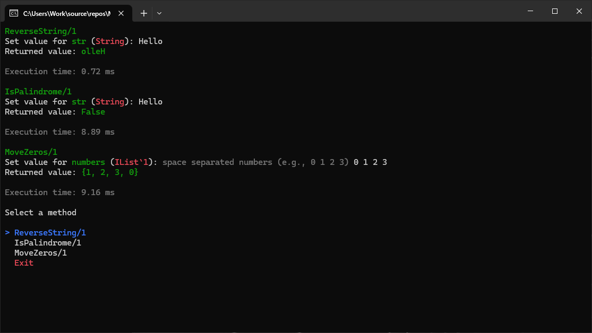

# MethodRunner

MethodRunner is a dynamic C# console utility built to discover and execute static methods at runtime.
By utilizing .NET Reflection and the Spectre.Console library, it provides an interactive command-line interface (CLI) to test algorithms, 
interview questions, or utility functions without needing to manually update the entry point for every test case.

## Features

- Automated Discovery: Uses Reflection to scan target classes for public static methods.

- Interactive UI: Implements selection prompts and status spinners using Spectre.Console.

- Dynamic Parameter Injection: Automatically detects method signatures and prompts the user for specific input types (strings, integers, or lists).

- Performance Tracking: Built-in stopwatch to measure and display method execution time in milliseconds.

- Input Validation: Includes Regex-based validation for numeric sequences and specialized collection parsing.

## Requirements

The project depends on the following:

- .NET 7.0 or higher

- Spectre.Console: Used for the interactive CLI components.

## Project Structure

### Main Runner

The entry point initializes the console encoding to UTF-8 and targets a specific class (e.g., CommonInterviewQuestions). It filters for static, public, and declared-only methods to populate the selection menu.

### Utils Class
Located in the IrishJohnDeRoxas.MethodRunner namespace, this partial class handles:
- Regex Cleaning: Sanitizes method names and string inputs.
- Dynamic Casting: Uses Convert.ChangeType to map console string inputs to the required ParameterInfo type.
- Result Formatting: Specialized logic to display primitive types, nulls, and collections (e.g., IList<int>).

### Target Class
The default implementation uses CommonInterviewQuestions

## Usage

1. __Define Methods__: Add any public static method to your target class.

2. Launch: Run the application.

3. Select: Use the arrow keys or type to filter the list of discovered methods.

4. Input: Follow the prompts to enter parameter values. For lists, enter space-separated numbers (e.g., 1 0 2 0 3).

5. Review: The application will display the returned value and the exact execution time.
